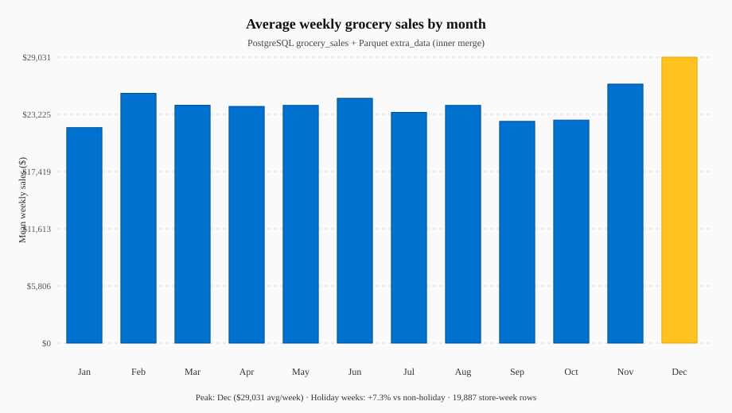

# Retail Data Pipeline — Walmart holiday sales

Batch data pipeline for **supply and demand analysis around public holidays** at a Walmart-scale US retailer. It combines **weekly grocery sales** from **PostgreSQL** with **complementary Parquet** (`extra_data.parquet`), builds `clean_data`, runs a **monthly sales summary** (`agg_data`), and exports **CSV** deliverables.

Educational portfolio project — uses **sample data**, not Walmart proprietary feeds.

## Business context

Walmart continues to scale **e-commerce** (roughly **$80B** in **2022**, ~**13%** of sales). Demand spikes on **Super Bowl, Labor Day, Thanksgiving, Christmas**, and similar holidays. Merchandising and supply chain teams need one place to join **store weekly sales** with **holiday and macro context** before forecasting or staffing decisions.

Full requirements: [docs/business-requirements.md](docs/business-requirements.md).

## What you will build (deliverables)


| Variable / file  | Contents                                                                        |
| ---------------- | ------------------------------------------------------------------------------- |
| `clean_data`     | `Store_ID`, `Month`, `Dept`, `IsHoliday`, `Weekly_Sales`, `CPI`, `Unemployment` |
| `agg_data`       | `Month`, `Weekly_Sales` (monthly mean of weekly sales)                          |
| `clean_data.csv` | `data/processed/clean_data.csv`                                                 |
| `agg_data.csv`   | `data/processed/agg_data.csv`                                                   |


## Pipeline steps (summary)

Detailed walkthrough: [docs/pipeline-steps.md](docs/pipeline-steps.md).

1. **Environment** — Docker Postgres + `extra_data.parquet` in `data/raw/` (`make seed`).
2. **Extract SQL** — `walmart.grocery_sales` → pandas → bronze CSV.
3. **Extract Parquet** — validate schema → bronze copy.
4. **Transform** — merge on `Store_ID` + `Date`, derive `Month` → `clean_data`.
5. **Analyze** — group by month → `agg_data`.
6. **Load** — write both CSVs under `data/processed/`.

Architecture diagram: [docs/architecture.md](docs/architecture.md).

## Results

After `make pipeline`, the batch job writes CSVs under `data/processed/` and refreshes the chart below (also saved to `docs/assets/` for the repo).



PNG for slides or LinkedIn: `data/processed/monthly_avg_weekly_sales.png` (after `make pipeline`).

| Insight | What it means |
| -------- | --------------- |
| **Monthly trend** | `agg_data` is the mean of `Weekly_Sales` across all store–department rows in each calendar month— a first view for seasonal planning. |
| **Peak month** | Highlighted bar = month with the highest average weekly sales in the merged dataset. |
| **Holiday lift** | Compares mean sales in **holiday weeks** (`IsHoliday = 1`) vs **non-holiday weeks** in `clean_data`— directional only, not causal. |
| **Grain** | Inner join on `Store_ID`, `Date`, and `Dept`; rows missing CPI/unemployment are dropped in the transform step. |

Regenerate the chart without re-querying Postgres (CSV must exist):

```bash
make results
```

**Sample run (local data):** peak month **Dec**, holiday-week sales about **+7%** vs non-holiday weeks—see the chart footnote after `make pipeline` or `make results`.
`
## Sources


### PostgreSQL — `grocery_sales`


| Column       | Description               |
| ------------ | ------------------------- |
| index        | Row id                    |
| Store_ID     | Store number              |
| Date         | Sales week                |
| Weekly_Sales | Sales for that store-week |


### Parquet — `extra_data.parquet`


| Column       | Description                         |
| ------------ | ----------------------------------- |
| IsHoliday    | 1 if week contains a public holiday |
| Temperature  | Temperature on sale day             |
| Fuel_Price   | Regional fuel cost                  |
| CPI          | Consumer price index                |
| Unemployment | Unemployment rate                   |
| MarkDown1–4  | Promotional markdowns               |
| Dept         | Department in store                 |
| Size         | Store size                          |
| Type         | Store type (related to Size)        |


Dictionary: [docs/data_dictionary.md](docs/data_dictionary.md).

## Stack


| Area                 | Choice                                    |
| -------------------- | ----------------------------------------- |
| SQL source           | PostgreSQL 16 (Docker Compose)            |
| File source          | Parquet (`pyarrow`)                       |
| Transform & analysis | **pandas**                                |
| Orchestration        | `pipeline/run_batch.py` (`make pipeline`) |
| Quality              | pytest on transform/analysis              |


## Repo map


| Path                                                     | Role                                       |
| -------------------------------------------------------- | ------------------------------------------ |
| [docker/](docker/)                                       | Postgres + mount for `data/raw` Parquet    |
| [ingest/sql/](ingest/sql/)                               | Extract `grocery_sales`                    |
| [ingest/parquet/](ingest/parquet/)                       | Extract `extra_data.parquet`               |
| [transform/walmart_clean.py](transform/walmart_clean.py) | Merge → `clean_data`                       |
| [analysis/monthly_sales.py](analysis/monthly_sales.py)   | `agg_data`                                 |
| [analysis/insights.py](analysis/insights.py)             | Peak month & holiday lift metrics          |
| [analysis/results_chart.py](analysis/results_chart.py)   | Results chart (SVG + PNG)                  |
| [load/csv_export.py](load/csv_export.py)                 | CSV deliverables                           |
| [docs/](docs/)                                           | Business requirements, architecture, steps |


## Quick start

```bash
cp .env.example .env
make setup
make seed
make pipeline
```

Postgres listens on **15432** (avoids conflict with a local instance on 5432).

Verify:

```bash
head -5 data/processed/clean_data.csv
cat data/processed/agg_data.csv
```


## Development

```bash
make test
make lint
```

Runbook: [docs/runbook.md](docs/runbook.md).

## License

MIT — [LICENSE](LICENSE).